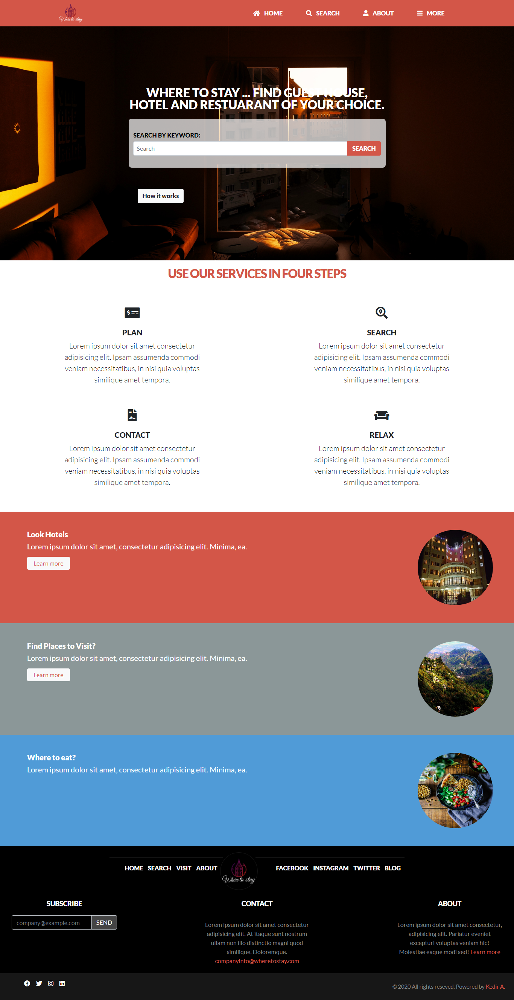

# WHERE TO STAY

> The main idea of this project is to make the life of tourists easy putting all they want on the same platform. It solves the problem of travelers accessing different websites and instead they can get it  in on place. So visitors can search available hotels, guest houses, restaurants and popular places to visit around the area they want to go. They can access the companies website if it's available.  

Additional description about the project and its features.

## Built With

- HTML,
- CSS[SASS]
- Bootstrap

## Live Demo

> Click the link to see the live demo.
[Open Live Demo](https://rawcdn.githack.com/keddo/HTMLCapstoneProject/bd48ac450a0852ecb5f5688822ef5c93a55fcaa4/index.html)

## Presentation video

> Click the link to open the presentation of the project .
[Open Video](https://www.loom.com/share/6de474170993446bae2307ee538a6fdf)

## Getting Started
- Clone the project to you local machine 
> git clone https://github.com/keddo/HTMLCapstoneProject.git

- Then run index file**

### Customize
- Install SASS as global using 
> npm install --global sass 
> npm install
- Add you own css on the sass files and compile it using 
> npm start

## Authors

👤 **Kedir**

- Github: [@keddo](https://github.com/keddo)
- Twitter: [@kedirman](https://twitter.com/kedirman)
- Linkedin: [@kedirabdurahman](https://www.linkedin.com/in/kedirabdurahman/)

## 🤝 Contributing

Contributions, issues and feature requests are welcome!

Feel free to check the [issues page](https://github.com/keddo/HTMLCapstoneProject/issues/2).

## Show your support

Give a ⭐️ if you like this project!

## Acknowledgments

- Hat tip to anyone whose code was used
- Inspiration
- etc
<!-- 
## 📝 License

This project is [MIT](lic.url) licensed. -->